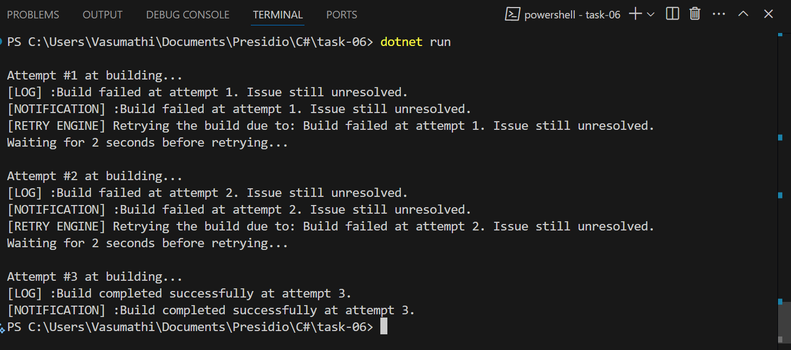

# Delegates and Events in C# 

## 🔹 What is a Delegate?
A **delegate** is like a reference to a method. It allows you to store a method in a variable and call it later.

### Example:
```csharp
public delegate void MyDelegate(string message);
```
Any method with `void` return type and one `string` parameter can be used with `MyDelegate`.

---

## 🔹 What is an Event?
An **event** is a way for one class to tell other classes that something has happened. Events use delegates internally.

---

## Delegate + Event Flow

### Steps:
1. **Declare a delegate** – defines method format.
2. **Declare an event** – based on that delegate.
3. **Subscribe** methods to the event.
4. **Trigger** the event – all subscribed methods are called.

---

## Build Notification System

### Delegate Declaration
```csharp
public delegate void BuildStatusHandler(string message);
```
- This allows pointing to methods with `void` return type and `string` parameter.

### Event Declaration
```csharp
public event BuildStatusHandler? BuildCompleted;
public event BuildStatusHandler? BuildFailed;
```
- `BuildCompleted` is called when build is successful.
- `BuildFailed` is called when build fails.

### Event Triggering Methods
```csharp
public void BuildSuccess(string message) {
    BuildCompleted?.Invoke(message);
}

public void BuildFailure(string message) {
    BuildFailed?.Invoke(message);
}
```
- `?.Invoke` means "if there are subscribers, call them."

### Subscriber Classes
```csharp
class Logger {
    public void Log(string message) {
        Console.WriteLine("[LOG] :" + message);
    }
}

class Notifier {
    public void Notify(string message) {
        Console.WriteLine("[NOTIFICATION] :" + message);
    }
}

class RetryEngine {
    public void Retry(string message) {
        Console.WriteLine("[RETRY ENGINE] Retrying the build due to: " + message);
    }
}
```

### Subscribing to Events
```csharp
buildStatus.BuildCompleted += log.Log;
buildStatus.BuildCompleted += notifier.Notify;

buildStatus.BuildFailed += log.Log;
buildStatus.BuildFailed += notifier.Notify;
buildStatus.BuildFailed += retry.Retry;
```
- When the build fails, all three methods run.
- When the build succeeds, only log and notify run.

### Main Program Simulation
```csharp
int counter = 0;
int retryLimit = 5;

while (counter < retryLimit) {
    Console.WriteLine($"\nAttempt #{counter + 1} at building...");
    if (counter < 2) {
        buildStatus.BuildFailure($"Build failed at attempt {counter + 1}.");
        Thread.Sleep(2000);
    } else {
        buildStatus.BuildSuccess($"Build completed successfully at attempt {counter + 1}.");
        break;
    }
    counter++;
}
```
- First two attempts fail → logs, notifies, retries.
- Third attempt succeeds → logs and notifies.

---



