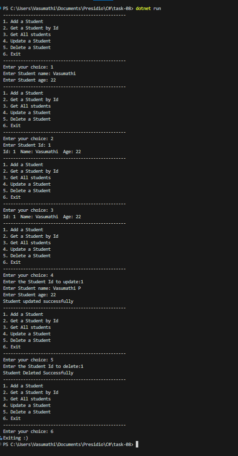

# Student Management Using Generic Repository (C#)

## Objective

- Learn how to use **Generics** and **Interfaces** in C#.
- Implement a **Generic Repository Pattern** for basic CRUD operations.
- Create reusable and type-safe data handling using `IEntity`, `IRepository<T>`, and `InMemoryRepository<T>`.

---

### 1. `IEntity`

```csharp
public interface IEntity {
    int Id { get; set; }
}
```

- Every entity like `Student` `Product` implements this to have a unique `Id`.

---

### 2. `IRepository<T>`

```csharp
public interface IRepository<T> where T : IEntity
```

- Generic interface for data operations.
- Has methods like: `Add`, `GetById`, `GetAll`, `Update`, `Delete`.

---

### 3. `InMemoryRepository<T>`

```csharp
public class InMemoryRepository<T> : IRepository<T> where T : IEntity
```

- Stores data in memory using a list.
- Automatically assigns IDs and supports all basic CRUD.

---

### 4. `Student` Class

```csharp
public class Student : IEntity {
    public int Id { get; set; }
    public string name { get; set; }
    public int age { get; set; }
}
```
- Creating a class `Student` that implements the IEntity interface.
---

## How It Works

- The console menu allows us to perform CRUD operations on the Student entity:
  - Add student
  - View by ID
  - View all
  - Update
  - Delete

---

## Output

